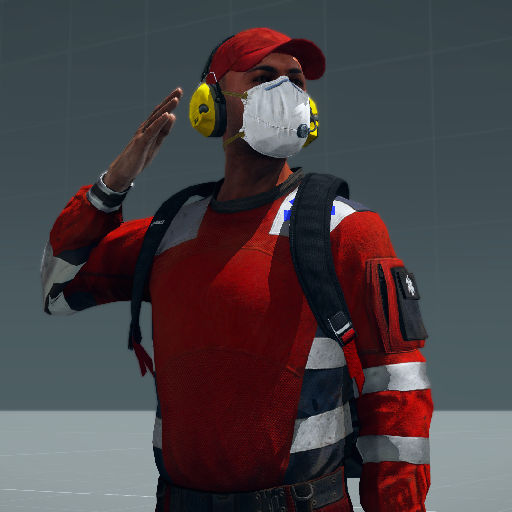

# 420th Customizations

An Arma 3 mod for the 420th Delta community.

<p align="center">
    <a href="https://steamcommunity.com/sharedfiles/filedetails/?id=3647324436">
        
    </a>
</p>

## Features

- Increased capacity of various vanilla clothing (see [Capacity Changes](#capacity-changes))
- Allowed loading vanilla magazines into modded weapons (CUP, NIArms, RHS, SOG, GM)
- Allowed loading modded pylons onto vanilla aircraft (CUP, RHS)
- Allowed attaching RHS grips on NIArms weaponry
- Allowed aimed usage of NVGs with modded optics (RHSUSAF)

## Capacity Changes

| Item                    | Original | New | Ratio  |
| ----------------------- | --------:| ---:| ------:|
| Aid Worker Clothes      |       30 | 120 |     4x |
| Assault Pack            |      160 | 320 |     2x |
| Casual Clothes (AoW)    |       20 |  80 |     4x |
| Combat Fatigues (LDF)   |       40 | 120 |     3x |
| CBRN Suit               |       30 | 120 |     4x |
| Everyday Backpack       |      240 | 320 |  1.33x |
| Farmer Outfit           |       20 |  80 |     4x |
| Field Pack              |      200 | 320 |   1.6x |
| Formal Suit             |       20 |  80 |     4x |
| Leg Strap Bag (Back)    |       80 | 320 |     4x |
| Leg Strap Bag (Vest)    |       80 | 300 |  3.75x |
| Messenger Bag           |      140 | 320 |  2.29x |
| Paramedic Outfit        |       30 | 500 | 16.67x |
| Sports Backpack         |      240 | 320 |  1.33x |
| Tracksuit               |       40 | 160 |     4x |

## Installation

To build the mod from source, install [HEMTT] and run the following command:

```sh
hemtt build
```

You can also build the mod for release with `hemtt release`, but you will need
to remove the `[signing]` configuration in project.toml to generate an ephemeral
signing key.

[HEMTT]: https://github.com/brettmayson/HEMTT

## License

This project is written under the [MIT] license.

[MIT]: /LICENSE
